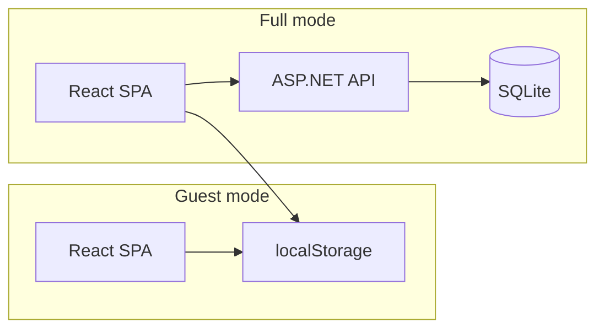

# Документация VibeTest

VibeTest — конструктор и прохождение тестов в браузере. Два режима работы: **guest** (автономный SPA без бэкенда) и **full** (React + ASP.NET API + SQLite).

## Оглавление

| Документ | Для кого | Содержание |
|----------|----------|------------|
| [overview.md](overview.md) | Новые участники | Назначение, режимы, стек, структура решения |
| [features.md](features.md) | Пользователи, QA | Маршруты, сценарии, импорт/экспорт, редактор и прохождение |
| [getting-started.md](getting-started.md) | Разработчики | Требования, запуск guest и full локально |
| [deployment.md](deployment.md) | DevOps | GitHub Pages, production full-mode, CI |
| [development.md](development.md) | Разработчики | Тесты, миграции, seed-данные, npm-скрипты |
| [api-reference.md](api-reference.md) | Backend / full | Краткий справочник REST API |
| [spec.md](spec.md) | Архитекторы | Глубокая техспецификация: БД, домен, DTO |

## Быстрые ссылки

**Запуск локально**

```bash
# Guest (только фронтенд)
cd VibeTest/vibetest.client && npm ci && npm run dev

# Full (API + фронтенд)
cd VibeTest && dotnet run --project VibeTest.Server
# в другом терминале:
cd VibeTest/vibetest.client && npm run dev:full
```

**Сборка и тесты**

```bash
npm run build:guest          # SPA для GitHub Pages
dotnet test VibeTest/          # интеграционные тесты
npm run e2e                    # Playwright: guest + full
```

## Режимы приложения

Режим задаётся на этапе сборки (`VITE_APP_MODE`), а не переключается в runtime.



| Режим | Бэкенд | Хранение тестов | Аутентификация |
|-------|--------|-----------------|----------------|
| **guest** | не нужен | localStorage | нет |
| **full** | ASP.NET Core | сервер + localStorage для локальных | JWT (access + refresh) |

Подробнее: [overview.md](overview.md) · [features.md](features.md)
