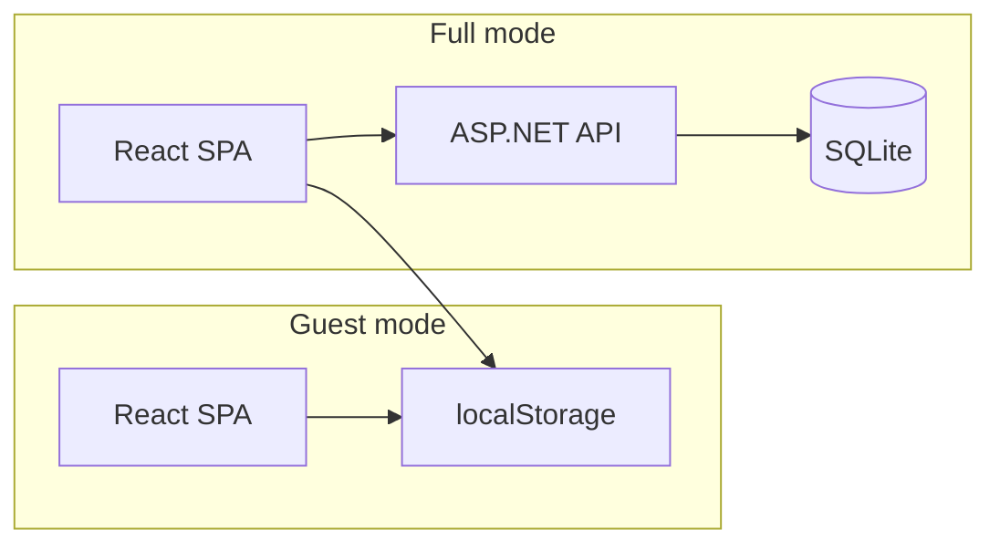

# Обзор VibeTest

## Назначение

**VibeTest** — веб-приложение для создания, импорта, прохождения и экспорта тестов с вопросами и вариантами ответов. Работает полностью в браузере; при необходимости подключается бэкенд для облачного хранения, публикации тестов и учёта результатов.

## Два режима (compile-time)

Режим выбирается переменной окружения `VITE_APP_MODE` при сборке или запуске Vite, а не переключается пользователем в интерфейсе.



| Аспект | Guest | Full |
|--------|-------|------|
| Бэкенд | не используется | `VibeTest.Server` |
| Тесты | только в localStorage | localStorage + сервер |
| Публичный каталог | нет | `/tests` с пагинацией |
| Аутентификация | нет | JWT (access + refresh) |
| Деплой | GitHub Pages | API + статика (см. [deployment.md](deployment.md)) |

Точка входа фронтенда — `src/App.tsx`: в зависимости от `appMode` монтируется `GuestApp` или `FullApp`.

## Стек технологий

| Слой | Технологии |
|------|------------|
| Фронтенд | React 19, TypeScript, Vite 8, React Router 7 |
| Бэкенд | ASP.NET Core 10, Entity Framework Core, SQLite |
| Аутентификация | JWT Bearer (только full) |
| E2E | Playwright |
| CI | GitHub Actions (E2E, деплой guest на Pages) |

## Структура решения

Проект основан на шаблоне Visual Studio «ASP.NET Core with React». Основные каталоги:

```
vibe-test/
├── docs/                    # документация
├── VibeTest/
│   ├── VibeTest.Server/     # ASP.NET API, EF, доменная логика
│   ├── vibetest.client/     # React SPA (guest + full)
│   └── VibeTest.Tests/      # интеграционные тесты сервисов и API
└── .github/workflows/       # CI/CD
```

### VibeTest.Server

- **Controllers** — REST API (`AuthController`, `TestsController`, `ResultsController`)
- **Services** — бизнес-логика (`TestService`, `ResultService`, `AuthService`, `UserService`)
- **Data** — `AppDbContext`, репозитории, миграции EF
- При старте (кроме `Testing`) выполняется `Database.Migrate()`

### vibetest.client

- **`src/guest/`** — маршруты и страницы guest-режима
- **`src/full/`** — аутентификация, API-клиент, страницы full-режима
- **`src/components/`** — общие компоненты (`TestEditor`, `TestPlayer`)
- **`src/utils/`** — импорт, экспорт, localStorage

### VibeTest.Tests

Интеграционные тесты сервисов на SQLite in-memory и API через `WebApplicationFactory`.

## Переменные окружения фронтенда

Определяются в `src/config/env.ts` и файлах `.env.*`:

| Переменная | Назначение | Пример |
|------------|------------|--------|
| `VITE_APP_MODE` | Режим: `guest` или `full` | `guest` |
| `VITE_BASE_PATH` | Базовый путь роутера и ассетов | `/` или `/vibe-test/` |
| `VITE_API_URL` | Базовый URL API (только full) | `/api` |

Файлы окружения:

- `.env.guest` — локальная разработка guest
- `.env.full` — локальная разработка full (прокси `/api` → Kestrel)
- `.env.guest.production` — сборка для GitHub Pages

## Дальше

- Пользовательские сценарии и маршруты: [features.md](features.md)
- Запуск локально: [getting-started.md](getting-started.md)
- Деплой: [deployment.md](deployment.md)
