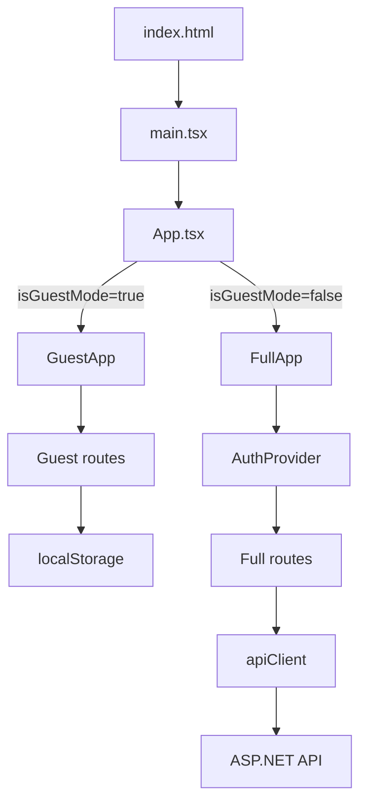

# 03. Запуск приложения и режимы guest/full

Главная цепочка запуска:

```text
index.html
  -> src/main.tsx
    -> src/App.tsx
      -> src/guest/GuestApp.tsx или src/full/FullApp.tsx
```

## Шаг 1. `index.html`

Браузер сначала получает `../VibeTest/vibetest.client/index.html`. Это не полноценная страница приложения, а HTML-shell.

Важные элементы:

- `div#root` - контейнер, куда React вставит UI;
- script на `src/main.tsx` - вход в TypeScript/React-код.

В ASP.NET аналогия: это минимальная host-страница. Но она не рендерит список тестов, формы и профили. Всё это делает React.

## Шаг 2. `main.tsx`

`../VibeTest/vibetest.client/src/main.tsx` делает три вещи:

```tsx
import { StrictMode } from 'react'
import { createRoot } from 'react-dom/client'
import './index.css'
import App from './App.tsx'

createRoot(document.getElementById('root')!).render(
  <StrictMode>
    <App />
  </StrictMode>,
)
```

Что здесь происходит:

- импортируется `index.css`, поэтому глобальные стили доступны всему приложению;
- `document.getElementById('root')!` находит DOM-элемент из `index.html`;
- `createRoot(...).render(...)` говорит React: управляй содержимым этого DOM-узла;
- `<StrictMode>` включает дополнительные проверки в development.

`!` после `getElementById` - TypeScript non-null assertion. Автор говорит компилятору: элемент точно есть.

## Шаг 3. `App.tsx`

`../VibeTest/vibetest.client/src/App.tsx` - очень маленький, но важный файл:

```tsx
function App() {
  return isGuestMode ? <GuestApp /> : <FullApp />;
}
```

Это главный разворот архитектуры. Одно React-приложение может собраться как:

- guest app;
- full app.

## Шаг 4. `env.ts`

`../VibeTest/vibetest.client/src/config/env.ts` читает значения из Vite env:

```ts
export const appMode = (import.meta.env.VITE_APP_MODE ?? 'guest') as AppMode;
export const isGuestMode = appMode === 'guest';
export const isFullMode = appMode === 'full';
export const basePath = import.meta.env.VITE_BASE_PATH ?? '/';
export const apiUrl = import.meta.env.VITE_API_URL ?? '/api';
```

`import.meta.env` - способ Vite дать frontend-коду переменные окружения на этапе запуска/сборки.

Важно: frontend env - не секретное хранилище. Всё, что попало в bundle, потенциально доступно пользователю в браузере.

## Guest-режим

Guest-режим запускается командой:

```bash
npm run dev
```

В `package.json` это:

```json
"dev": "vite --mode guest"
```

Что это значит:

- Vite загружает guest env;
- `VITE_APP_MODE` становится `guest`;
- `App.tsx` выбирает `<GuestApp />`;
- приложение работает без backend API;
- тесты, прогресс и результаты хранятся в `localStorage`;
- PWA включается для guest production-сборки.

`GuestApp` при старте вызывает `seedGuestTestsIfEmpty()`, чтобы положить demo-тесты в localStorage, если там пусто.

## Full-режим

Full-режим запускается командой:

```bash
npm run dev:full
```

В `package.json` это:

```json
"dev:full": "vite --mode full"
```

Что происходит:

- Vite загружает full env;
- `VITE_APP_MODE` становится `full`;
- `App.tsx` выбирает `<FullApp />`;
- приложение оборачивается в `<AuthProvider>`;
- страницы могут обращаться к `/api`;
- Vite dev server проксирует `/api` на ASP.NET backend.

## Почему два режима в одном коде

Это компромисс:

- guest-режим можно задеплоить как статический сайт, например GitHub Pages;
- full-режим использует те же общие компоненты, но добавляет backend, пользователей и заявки;
- редактор и player тестов переиспользуются между режимами.

Главная идея: общая предметная логика тестов находится в shared-компонентах, а различия источников данных спрятаны в guest/full pages, storage и API layer.

## Схема запуска



## Что смотреть при отладке

- Не тот режим приложения - проверьте env и `src/config/env.ts`.
- Не та стартовая страница - проверьте маршруты в `GuestApp.tsx` или `FullApp.tsx`.
- API не вызывается - убедитесь, что запущен full-режим, а не guest.
- Путь ломается после деплоя - смотрите `VITE_BASE_PATH` и `src/utils/router.ts`.

