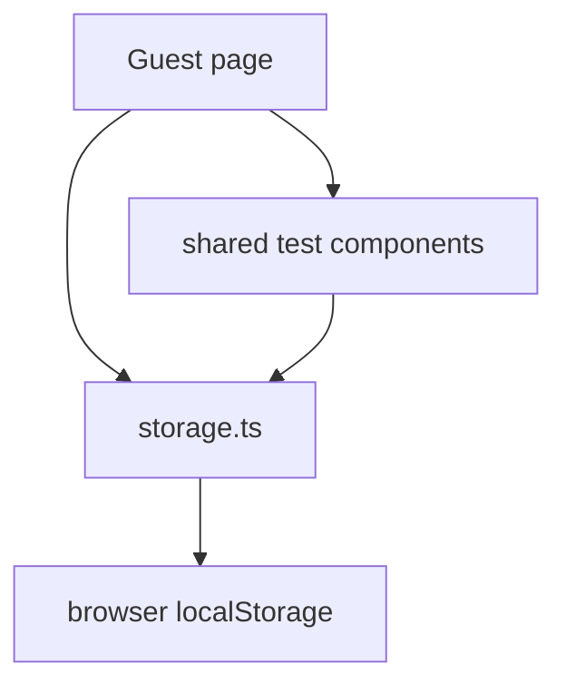
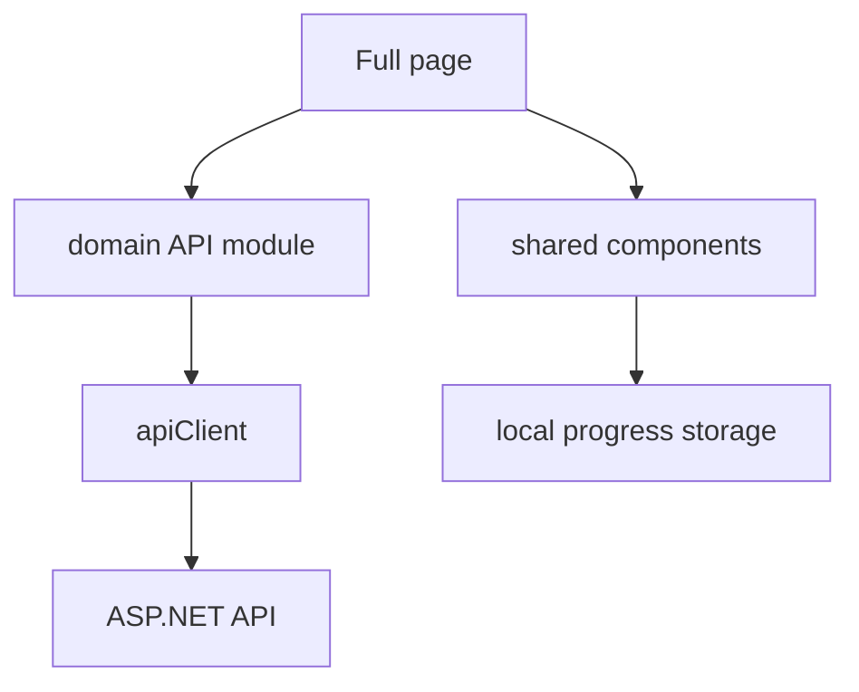

# 06. State, storage и data flow

Во frontend важно понимать, где живут данные. В `VibeTest` есть несколько уровней состояния:

- локальный state компонента;
- custom hook state;
- Context для auth;
- `localStorage`;
- backend API в full-режиме.

## Локальный state компонента

Локальный state хранится через `useState`. Он живёт, пока компонент находится на экране.

Примеры типичных состояний:

- `isLoading`;
- `error`;
- значения формы;
- выбранный вопрос;
- текущая страница списка.

Когда компонент размонтируется, локальный state исчезает. Если нужно пережить перезагрузку страницы, нужен storage или backend.

## Custom hook state

Сложную UI-логику проект выносит в custom hooks.

Пример: `../VibeTest/vibetest.client/src/components/tests/player/useTestPlayerController.ts`.

`TestPlayer` получает готовый объект `player`:

```tsx
const player = useTestPlayerController(source);
```

Так компонент отображения не превращается в огромный файл с бизнес-логикой. Hook управляет фазами прохождения, выбранными ответами, ошибками и завершением.

## `localStorage`

`localStorage` - встроенное хранилище браузера. Данные сохраняются между перезагрузками страницы, но только в конкретном браузере и домене.

В проекте доступ к нему централизован в `../VibeTest/vibetest.client/src/utils/storage.ts`.

Ключи:

- `vibetest_local_tests` - локальные тесты;
- `vibetest_guest_results` - результаты guest-прохождений;
- `vibetest_progress_{id}` - прогресс локального теста;
- `vibetest_progress_api_{id}` - прогресс API-теста;
- `vibetest_application_progress_{token}` - прогресс прохождения по заявке.

Функции вроде `getLocalTests`, `saveLocalTest`, `deleteLocalTest` скрывают детали JSON serialization.

## Почему не обращаться к `localStorage` напрямую

Лучше использовать `storage.ts`, потому что:

- ключи собраны в одном месте;
- JSON parsing/writing одинаковый;
- есть fallback при ошибке чтения;
- после изменений вызывается `notifyStorageChange()`;
- проще менять формат хранения позже.

Для C# аналогия: не разбрасывать SQL-запросы по контроллерам, а иметь repository/service layer.

## Guest data flow

Guest-режим работает без API.



Например:

1. При первом старте `GuestApp` вызывает `seedGuestTestsIfEmpty()`.
2. Seed-функция кладёт demo-тесты в `localStorage`.
3. `LocalTestsPage` читает список тестов через `storage.ts`.
4. `TestPlayer` сохраняет прогресс прохождения.

## Full data flow

Full-режим использует backend API, но часть локальных возможностей сохраняется.



Список публичных тестов, профиль, заявки и cloud-тесты приходят из API. Прогресс прохождения может сохраняться локально, чтобы пользователь не потерял состояние.

## Auth state

Auth state живёт в `../VibeTest/vibetest.client/src/full/context/AuthContext.tsx`.

Он хранит:

- текущего пользователя `user`;
- флаг `isAuthenticated`;
- флаг `isLoading`;
- методы `login`, `register`, `logout`;
- логику refresh token.

`AuthProvider` оборачивает full-приложение:

```tsx
<AuthProvider>
  <BrowserRouter>...</BrowserRouter>
</AuthProvider>
```

Любой дочерний компонент может вызвать `useAuth()` и получить auth state.

## Access token и refresh token

В full-режиме:

- access token хранится в памяти API-клиента;
- refresh token хранится отдельно через `authStorage.ts`;
- при 401 API-клиент пытается обновить access token;
- если refresh не удался, пользователь разлогинивается.

Это описано подробнее в `07-api-auth-and-backend-integration.md`.

## Data flow в React

Типичный поток:

```text
User action -> event handler -> setState/API/storage -> state changed -> render -> DOM updated
```

Пример:

1. Пользователь нажал "Далее" в тесте.
2. `onClick` вызывает handler из `player`.
3. Hook обновляет текущий вопрос или фазу.
4. React заново вызывает компонент.
5. JSX теперь описывает новый экран.
6. React минимально обновляет DOM.

## Loading и error states

Почти каждая страница с данными должна учитывать:

- данные ещё грузятся;
- загрузка завершилась ошибкой;
- данных нет;
- данные есть.

В `TestPlayer` это видно по ранним return:

- loading;
- error;
- completed;
- empty current question;
- normal player.

Такой стиль удобен: сначала обрабатываются исключительные состояния, потом основной UI.

## Что может пойти не так

- Изменили localStorage-формат без миграции - старые данные могут не читаться.
- Забыли вызвать setter state - UI не обновится.
- Вызвали API в guest-режиме - backend может быть недоступен.
- Положили секрет в frontend env - он станет доступен пользователю.
- Напрямую изменили массив/объект state - React может не увидеть изменение.

## Практическое правило

Когда видите данные на экране, задайте три вопроса:

1. Откуда они пришли: props, state, context, storage или API?
2. Кто имеет право их менять?
3. Переживут ли они refresh страницы?

