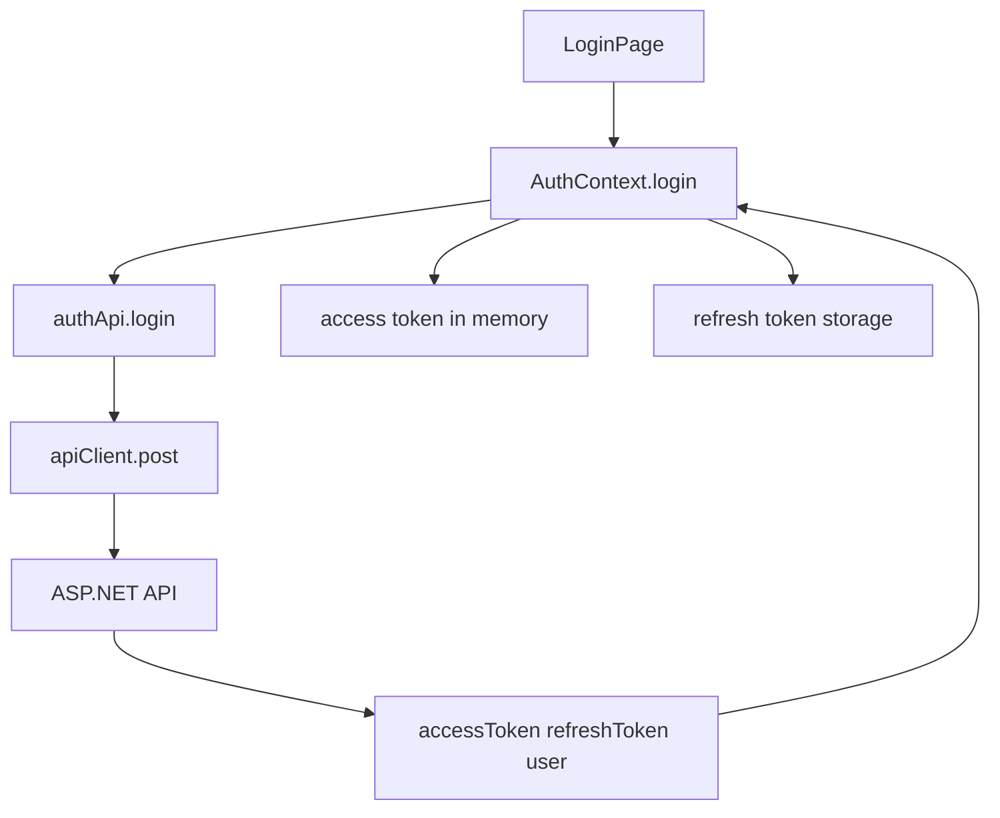

# 07. API, auth и интеграция с backend

Full-режим фронтенда работает как SPA-клиент для ASP.NET API. Он не рендерит страницы на сервере, а вызывает JSON endpoints.

Главные файлы:

- `../VibeTest/vibetest.client/src/full/api/client.ts`;
- `../VibeTest/vibetest.client/src/full/api/auth.ts`;
- `../VibeTest/vibetest.client/src/full/api/tests.ts`;
- `../VibeTest/vibetest.client/src/full/api/applications.ts`;
- `../VibeTest/vibetest.client/src/full/api/users.ts`;
- `../VibeTest/vibetest.client/src/full/api/results.ts`;
- `../VibeTest/vibetest.client/src/full/context/AuthContext.tsx`;
- `../VibeTest/vibetest.client/src/types/api.ts`.

## Слои API-кода

В проекте API устроен слоями:

```text
Page component
  -> domain API module
    -> apiClient
      -> fetch
        -> ASP.NET API
```

Для C# аналогия:

- page component - controller/view на клиенте;
- domain API module - typed service;
- `apiClient` - общий HTTP client wrapper;
- backend API - ASP.NET controllers.

## Domain API modules

Файлы вроде `auth.ts` и `tests.ts` содержат функции предметной области.

Пример по смыслу:

```ts
export const authApi = {
  login: (payload: LoginPayload) =>
    apiClient.post<AuthResponse>('/auth/login', payload),

  me: () => apiClient.get<UserDto>('/auth/me'),
};
```

Страница логина не должна знать, как именно добавить headers или обработать 401. Она вызывает `authApi.login`.

## `apiClient`

`../VibeTest/vibetest.client/src/full/api/client.ts` - общий wrapper над browser `fetch`.

Он делает:

- собирает URL из `apiUrl + path`;
- добавляет `Accept: application/json`;
- если есть body, добавляет `Content-Type: application/json`;
- если есть access token, добавляет `Authorization: Bearer ...`;
- сериализует body через `JSON.stringify`;
- парсит JSON-ответ;
- бросает `ApiError` при неуспешном status;
- при `401` пытается refresh token;
- дедуплицирует параллельные GET на один path.

## `fetch`

`fetch` - встроенный browser API для HTTP-запросов.

Пример:

```ts
const response = await fetch('/api/tests');
```

В проекте напрямую `fetch` обычно не вызывают из страниц. Используют `apiClient`, чтобы не дублировать auth/error логику.

## Base URL API

В `../VibeTest/vibetest.client/src/config/env.ts`:

```ts
export const apiUrl = import.meta.env.VITE_API_URL ?? '/api';
```

По умолчанию frontend вызывает `/api/...`.

В dev full-режиме Vite proxy перенаправляет `/api` на ASP.NET backend. Это настроено в `vite.config.ts`:

```ts
proxy: {
  '^/api': {
    target: apiTarget,
    secure: false,
  },
}
```

Для браузера запрос выглядит как запрос к Vite dev server. Vite пересылает его backend.

## Auth flow

Регистрация или login:



После успешного login:

- access token сохраняется в памяти через `setAccessToken`;
- refresh token сохраняется через `setRefreshToken`;
- user кладётся в React state;
- `isAuthenticated` становится `true`.

## Bootstrap session

Когда full-приложение открывается после refresh страницы, access token в памяти уже потерян. Поэтому `AuthProvider`:

1. читает refresh token;
2. вызывает `/auth/refresh`;
3. получает новый access token;
4. вызывает `/auth/me`;
5. кладёт user в state.

Пока это происходит, `isLoading` равен `true`.

## Обработка `401`

Если API вернул `401`, `apiClient` пытается обновить access token:

```text
request -> 401 -> refreshSession -> repeat request -> success
```

Если refresh не удался:

```text
request -> 401 -> refreshSession failed -> logout
```

Это похоже на delegating handler в .NET HTTP client pipeline, который добавляет token и умеет повторять запрос.

## Где хранится token

В этом проекте:

- access token - в памяти JS-модуля `apiClient`;
- refresh token - через `../VibeTest/vibetest.client/src/utils/authStorage.ts`.

Не нужно класть access token в каждый компонент. Компоненты работают через `authApi`, `testsApi` и другие domain modules.

## DTO и payload types

Типы API лежат в `../VibeTest/vibetest.client/src/types/api.ts`.

Они помогают:

- видеть структуру request/response;
- получать автодополнение IDE;
- ловить ошибки несоответствия при сборке;
- документировать контракт frontend-backend.

Но TypeScript не валидирует JSON в runtime. Если backend вернёт неправильную форму, TypeScript сам это не поймает в браузере.

## Ошибки API

`../VibeTest/vibetest.client/src/full/api/errors.ts` определяет `ApiError` и чтение сообщения ошибки.

`AuthContext` содержит helper:

```ts
export function getApiErrorMessage(error: unknown): string
```

Это удобно для страниц: они могут показать человеку понятное сообщение, не разбирая каждый тип ошибки заново.

## ProtectedRoute и backend security

`ProtectedRoute` прячет страницы от неавторизованного пользователя. Но это не безопасность backend.

Правило:

- frontend route guard - удобство и UX;
- backend authorization - настоящая защита данных.

Пользователь может открыть DevTools или отправить HTTP-запрос напрямую, поэтому backend должен проверять JWT и права.

## Как добавить новый API-вызов

Типичный порядок:

1. Добавить/уточнить DTO type в `src/types/api.ts`.
2. Добавить метод в подходящий файл `src/full/api/*.ts`.
3. Использовать метод из page/component.
4. Обработать loading/error/success states.
5. Проверить, нужен ли protected route или backend authorization.

## Что проверять при ошибках API

- Запущен ли full-режим, а не guest.
- Запущен ли backend.
- Совпадает ли `VITE_API_URL`.
- Работает ли Vite proxy `/api`.
- Есть ли access token.
- Не истёк ли refresh token.
- Возвращает ли backend JSON той формы, которую ожидает TypeScript type.

