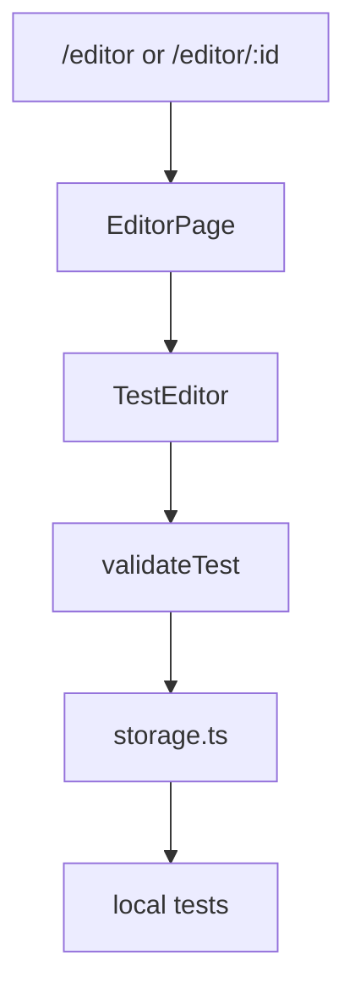
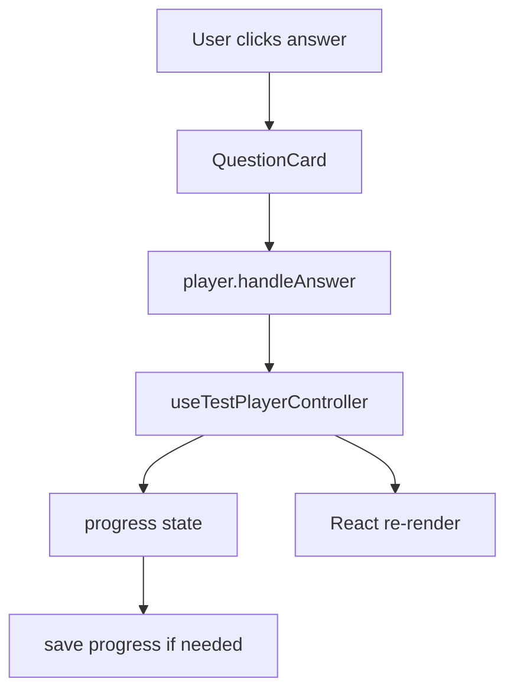

# 08. Разбор основного функционала

Основная предметная область VibeTest - создание, хранение, импорт, публикация и прохождение тестов.

Ключевые shared-компоненты:

- `../VibeTest/vibetest.client/src/components/tests/TestEditor.tsx`;
- `../VibeTest/vibetest.client/src/components/tests/TestPlayer.tsx`;
- `../VibeTest/vibetest.client/src/components/tests/player/useTestPlayerController.ts`;
- `../VibeTest/vibetest.client/src/components/tests/player/playerSources.ts`;
- `../VibeTest/vibetest.client/src/components/tests/LocalTestsList.tsx`;
- `../VibeTest/vibetest.client/src/components/tests/TestImportPanel.tsx`.

## Почему shared-компоненты важны

Guest и full режимы отличаются источниками данных, но UI тестов во многом общий.

Например, прохождение теста должно выглядеть одинаково:

- локальный тест из `localStorage`;
- публичный тест из API;
- тест по application token.

Поэтому `TestPlayer` не должен быть жёстко привязан к одному источнику. Он получает `source`.

## Список тестов

В guest-режиме список локальных тестов берётся из `localStorage`.

Поток:

```text
LocalTestsPage
  -> storage.ts getLocalTests()
  -> LocalTestsList
  -> user action
  -> edit/play/delete/export
```

В full-режиме есть разные списки:

- публичные тесты;
- мои тесты;
- локальные тесты;
- заявки.

Full-страницы обычно вызывают `testsApi` или другие API modules.

## Редактор теста

Редактор доступен в маршрутах:

- `/editor`;
- `/editor/:id`.

В guest-режиме это создание/редактирование локального теста. В full-режиме editor тоже доступен, потому что локальные тесты остаются полезны.

Типичный flow:



`TestEditor` отвечает за UI формы теста: название, описание, вопросы, варианты ответов, объяснения.

Что полезно помнить:

- форма хранит промежуточное состояние в React state;
- сохранение превращает форму в `TestDefinition`/`LocalTest`;
- валидация должна происходить до сохранения;
- после сохранения данные попадают в `localStorage`.

## Импорт и экспорт

Импорт нужен, чтобы загрузить тест из JSON.

Связанные файлы:

- `../VibeTest/vibetest.client/src/utils/import.ts`;
- `../VibeTest/vibetest.client/src/utils/export.ts`;
- `../VibeTest/vibetest.client/src/utils/importTemplate.ts`;
- `../VibeTest/vibetest.client/src/components/tests/TestImportPanel.tsx`.

Поток импорта:

```text
User selects/pastes JSON
  -> parse JSON
  -> validate structure
  -> normalize if needed
  -> create local test
  -> save to localStorage
```

Для C# аналогия: deserialize JSON -> validate DTO -> map to domain/local model -> save.

## Прохождение теста

Главный компонент: `../VibeTest/vibetest.client/src/components/tests/TestPlayer.tsx`.

Он не содержит всю логику сам. Он вызывает:

```tsx
const player = useTestPlayerController(source);
```

`player` - объект с состоянием и handlers:

- `phase`;
- `questions`;
- `currentQuestion`;
- `progress`;
- `handleAnswer`;
- `handleNext`;
- `goToQuestion`;
- `handleRetry`;
- `completedSummary`;
- flags вроде `canGoNext`, `isChecking`, `canRetry`.

`TestPlayer` на основе этого объекта рисует UI.

## Фазы player

У player есть фазы:

- loading - тест загружается;
- active/checking/review-подобные состояния внутри controller;
- completed - тест завершён;
- error - ошибка загрузки или проверки.

На уровне UI это видно так:

```text
loading -> "Загрузка теста..."
completed -> TestResultSummary
normal -> QuestionNav + QuestionCard + toolbar
```

## Источники теста

`playerSources.ts` помогает загрузить тест из разных источников.

Идея:

```text
TestPlayer does not care where test came from
source knows how to load/check/save for this scenario
```

Возможные источники по смыслу:

- local test;
- API test;
- application token.

Это хороший frontend-паттерн: общий UI получает abstraction, а различия остаются в adapter/source layer.

## Ответ на вопрос

Упрощённый flow:



`QuestionCard` не обязан знать, как именно сохранить прогресс. Он вызывает callback.

## Завершение теста

Когда вопросы закончились:

- controller формирует summary;
- `TestPlayer` видит `phase === 'completed'`;
- рендерит `TestResultSummary`;
- в guest/full сценариях результат может сохраняться по-разному.

Если доступен retry, `onRetry` запускает повторное прохождение.

## Заявки applications

Full-режим добавляет сценарии заявок:

- `ApplicationsPage`;
- `ApplicationPlayPage`;
- `ApplicationCreateForm`;
- API в `src/full/api/applications.ts`.

Смысл: пользователь может проходить тест по специальной ссылке/token, а настройки заявки могут скрывать результаты.

На уровне player это учитывается flags вроде `applicationHideResults`.

## Как вносить изменения в feature

Если меняется UI вопроса:

1. Смотрите `QuestionCard`.
2. Проверьте `tests.css`.
3. Проверьте, не влияет ли изменение на `TestPlayer`.

Если меняется логика прохождения:

1. Смотрите `useTestPlayerController`.
2. Проверьте `playerSources`.
3. Проверьте сохранение progress в `storage.ts`.

Если меняется источник данных:

1. Guest - `storage.ts`, guest pages.
2. Full - `src/full/api`, full pages, DTO types.
3. Shared player - только если меняется общий contract.

## Что важно новичку

Не пытайтесь понять весь frontend сразу. Для feature полезно идти по цепочке:

```text
route -> page -> component -> hook/API/storage -> type/CSS
```

Так вы быстро отделите "где экран" от "где данные" и "где стиль".

